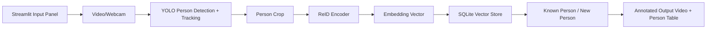

# Local Person Re-Identification MVP

Dieses Repository ist ein kleines, lokal lauffähiges MVP für **Person Re-Identification**.
Es nimmt ein Video oder optional eine lokale Webcam als Eingabe, erkennt Personen, verfolgt sie im Video, erstellt Embeddings aus den Person-Crops und speichert synthetische Personen-IDs in einer lokalen Datenbank.

---

starten mit
python -m streamlit run app/ui/streamlit_app.py

prüfen ob mit in der virtuallen umgebung ist
.\.venv\Scripts\Activate.ps1
python -c "import sys; print(sys.executable)"

reset wenn man auf colorhist gearbeitete hat
python scripts/reset_db.py

den colorhist arbeitet mit 32 dimenseionen

torchreid / OSNet auf 512

## 1. Was dieses Setup macht



Das Setup besteht aus:

| Modul              | Datei                              | Zweck                                                      |
| ------------------ | ---------------------------------- | ---------------------------------------------------------- |
| UI                 | `app/ui/streamlit_app.py`          | Eingabe-Panel für Video/Webcam und Parameter               |
| Pipeline           | `app/pipeline/orchestrator.py`     | Koordiniert Detection, Tracking, Embedding und Speicherung |
| Detection/Tracking | `app/pipeline/detector_tracker.py` | Nutzt Ultralytics YOLO mit ByteTrack oder BoT-SORT         |
| ReID Encoder       | `app/pipeline/reid_encoder.py`     | Erzeugt Embeddings aus Person-Crops                        |
| Vector Store       | `app/storage/vector_store.py`      | Speichert und sucht Personen-Embeddings lokal in SQLite    |
| Modelle            | `app/storage/models.py`            | Dataclasses für Detection, Match, Ergebnis                 |
| Utils              | `app/utils/*`                      | Cropping, Zeichnen, Kamera-Scanning, ID-Helfer             |

---

## 2. Technische Basis

Dieses MVP nutzt standardmäßig:

- **Streamlit** als kleines lokales Eingabe-Panel.
- **Ultralytics YOLO** für Person Detection und Tracking.
- **ByteTrack** oder **BoT-SORT** als Tracker.
- **Color Histogram Encoder** als sofort lauffähigen, sehr kleinen Demo-ReID-Encoder.
- **SQLite** als lokale Embedding- und Metadaten-Datenbank.

Optional kann später ein echter Person-ReID-Encoder wie **Torchreid / OSNet** aktiviert werden. Der Code enthält dafür bereits einen Adapter.

Relevante Dokumentationen:

- Ultralytics Tracking: https://docs.ultralytics.com/modes/track/
- Torchreid / OSNet: https://kaiyangzhou.github.io/deep-person-reid/
- Streamlit File Upload: https://docs.streamlit.io/develop/api-reference/widgets/st.file_uploader
- Streamlit Camera Input: https://docs.streamlit.io/develop/api-reference/widgets/st.camera_input
- Qdrant Local Quickstart, falls ihr später Qdrant statt SQLite nutzen wollt: https://qdrant.tech/documentation/quickstart/

---

## 3. Projektstruktur

```text
person-reid-mvp/
├── app/
│   ├── main.py
│   ├── config.py
│   ├── ui/
│   │   └── streamlit_app.py
│   ├── pipeline/
│   │   ├── detector_tracker.py
│   │   ├── orchestrator.py
│   │   └── reid_encoder.py
│   ├── storage/
│   │   ├── models.py
│   │   └── vector_store.py
│   └── utils/
│       ├── camera_utils.py
│       ├── id_utils.py
│       └── image_utils.py
├── scripts/
│   └── reset_db.py
├── data/
│   ├── input/
│   ├── output/
│   ├── snapshots/
│   └── db/
├── requirements.txt
├── requirements-optional-reid.txt
├── docker-compose.yml
├── .env.example
└── README.md
```

---


---

## 3.1 Mode-System

Der bisherige MVP-Stand ist jetzt als auswählbarer Modus registriert:

```text
default
```

Zusätzlich gibt es einen vorbereiteten Fußballmodus:

```text
football_team_analysis
```

Die Modi liegen in:

```text
app/modes/
├── base_mode.py
├── default_mode.py
├── football_mode.py
└── mode_registry.py
```

Im Streamlit-UI kann der Modus in der Sidebar ausgewählt werden. Außerdem können eigene Custom Modes erstellt werden. Diese werden lokal gespeichert unter:

```text
data/modes/custom_modes.json
```

Ein Modus speichert aktuell vor allem Konfiguration und Feature-Flags, z. B.:

- YOLO-Modell
- Tracker
- Encoder-Backend
- Match Threshold
- Max Frames
- Football-Flags für Balltracking, Teamklassifikation, Pitch Mapping und Statistik-Aggregation

Wichtig: Der `football_team_analysis`-Modus nutzt in V1 noch die stabile Default-ReID-Pipeline. Balltracking, Pitch Mapping und echte Statistikberechnung sind vorbereitet, aber noch nicht vollständig verdrahtet.

---

## 3.2 Football Mode Roadmap

Langfristiges Ziel des Football Modes ist die Analyse von Fußballvideos:

```text
Video Input
→ Spieler erkennen
→ Spieler tracken
→ Team zuordnen
→ Ball erkennen
→ Spielfeldkoordinaten berechnen
→ Statistiken aggregieren
```

Geplante Datenpunkte:

| Datenbereich | Beispiele |
|---|---|
| Run-Daten | run_id, mode_id, Quelle, FPS, Auflösung |
| Spieler pro Frame | track_id, player_id, bbox, confidence, pitch_x, pitch_y |
| Ball pro Frame | bbox, confidence, pitch_x, pitch_y, nächster Spieler |
| Teamdaten | team_id, Teamname, Trikotfarbe |
| Statistiken | Distanz, Geschwindigkeit, Sprintanzahl, Heatmap, Ballnähe |

Vorbereitete Module:

```text
app/pipeline/football/
├── ball_detector.py
├── football_orchestrator.py
├── pitch_mapper.py
├── stats_aggregator.py
└── team_classifier.py
```

Empfohlene nächste Implementierungsreihenfolge:

1. Team-Farbklassifikation in die bestehende Crop-Verarbeitung einbauen.
2. Ball Detection mit eigenem Modell oder Roboflow-Dataset ergänzen.
3. Pitch Mapping per Homography aktivieren.
4. Spielerpositionen in Meterkoordinaten speichern.
5. Distanz-, Speed-, Heatmap- und Ballnähe-Statistiken berechnen.

---

## 4. Setup Guide

### 4.1 Voraussetzungen

Empfohlen:

- Python 3.10 oder 3.11
- Windows, macOS oder Linux
- Optional: NVIDIA GPU mit CUDA, aber nicht erforderlich

Das MVP läuft auch auf CPU. Für Echtzeit-Video ist eine GPU sinnvoll, aber für erste Tests reicht CPU mit kleinen Videos.

---

### 5.2 Repository entpacken

```bash
unzip person-reid-mvp.zip
cd person-reid-mvp
```

---

### 4.3 Virtuelle Umgebung erstellen

#### Windows PowerShell

```powershell
python -m venv .venv
.\.venv\Scripts\Activate.ps1
python -m pip install --upgrade pip
```

Falls PowerShell das Aktivieren blockiert:

```powershell
Set-ExecutionPolicy -ExecutionPolicy RemoteSigned -Scope CurrentUser
.\.venv\Scripts\Activate.ps1
```

#### macOS/Linux

```bash
python3 -m venv .venv
source .venv/bin/activate
python -m pip install --upgrade pip
```

---

### 4.4 Dependencies installieren

```bash
pip install -r requirements.txt
```

Beim ersten Start lädt Ultralytics automatisch ein kleines YOLO-Modell herunter, z. B. `yolov8n.pt`. Das ist für den MVP normal.

---

### 5.5 App starten

```bash
streamlit run app/ui/streamlit_app.py
```

Danach öffnet sich im Browser normalerweise:

```text
http://localhost:8501
```

---

## 5. Bedienung

### Option A: Video hochladen

1. App starten.
2. In der Sidebar Parameter prüfen.
3. Bei `Input type` die Option `Video upload` wählen.
4. Eine `.mp4`, `.mov`, `.avi` oder `.mkv` Datei hochladen.
5. Auf `Run re-identification` klicken.
6. Ergebnisvideo und Personentabelle ansehen.

### Option B: Lokale Webcam verwenden

1. App lokal auf dem Rechner starten, an dem die Webcam hängt.
2. `Input type` auf `Local webcam` stellen.
3. Unter `Camera backend` auf Windows zuerst `dshow` verwenden. Falls das nicht klappt, `msmf` oder `auto` testen.
4. Das UI scannt lokale OpenCV-Kameraindizes und zeigt gefundene Quellen mit Auflösung an, z. B. `Camera 0 [dshow] - 1280x720`.
5. Falls deine Kamera nicht gefunden wird, `Refresh` klicken oder `Use manual camera index` aktivieren und Index `0`, `1`, `2` usw. testen.
6. Mit `Test selected camera` ein einzelnes Rohbild prüfen.
7. In der Sidebar `Show live annotated preview` aktiv lassen.
8. Auf `Run re-identification` klicken. Während der Verarbeitung wird nun ein Live-Bild mit Bounding Boxes, Track-ID, synthetischer Person-ID und Confidence angezeigt.

Hinweis: Die lokale Webcam wird über OpenCV geöffnet. Das ist nicht dasselbe wie die Browser-Media-Auswahl über `navigator.mediaDevices`. `Camera 0 [dshow]` greift auf die Webcam des Rechners zu, auf dem Streamlit läuft. Läuft Streamlit in Docker oder auf einem Server, ist das nicht automatisch die Webcam deines Browsers. Für echte Browser-Kameraauswahl wäre später `streamlit-webrtc` sinnvoll.

---

## 6. Wichtige Parameter

| Parameter                     | Bedeutung                                                                           | Empfehlung für Start |
| ----------------------------- | ----------------------------------------------------------------------------------- | -------------------- |
| `YOLO model`                  | Detection-Modell                                                                    | `yolov8n.pt`         |
| `Tracker`                     | Tracking-Algorithmus                                                                | `bytetrack.yaml`     |
| `Match threshold`             | Mindestähnlichkeit für Wiedererkennung                                              | `0.82`               |
| `ReID every N frames`         | Wie oft Embeddings aktualisiert werden                                              | `10`                 |
| `Max frames`                  | Begrenzung für Tests                                                                | `300` bis `1000`     |
| `Device`                      | CPU/GPU-Auswahl                                                                     | `auto`               |
| `Show live annotated preview` | Zeigt während der Verarbeitung das echte Kamerabild mit gezeichneten Tracking-Boxen | aktiviert            |
| `Preview every N frames`      | Reduziert UI-Last bei Live-Vorschau                                                 | `2`                  |

Wenn viele Personen fälschlich zusammengelegt werden, erhöhe den Threshold, z. B. von `0.82` auf `0.90`.

Wenn dieselbe Person oft als neue Person erkannt wird, senke den Threshold leicht, z. B. auf `0.75`.

---

## 7. Datenbank und gespeicherte Daten

Standardpfade:

```text
data/db/reid.sqlite3
data/snapshots/
data/output/
```

Gespeichert werden:

- synthetische Person-ID
- durchschnittlicher Embedding-Vektor
- Anzahl der Beobachtungen
- Zeitpunkte `created_at` und `last_seen`
- Events mit Track-ID, Frame-Index, Bounding Box, Similarity Score und Snapshot-Pfad

Nicht gespeichert werden:

- echte Namen
- echte Identitäten
- Login-Daten
- externe Cloud-Daten

---

## 8. Datenbank zurücksetzen

```bash
python scripts/reset_db.py
```

Das löscht:

- SQLite-Datenbank
- gespeicherte Snapshots
- Output-Videos

---

## 9. Optional: Torchreid / OSNet aktivieren

Der Standard-Encoder `colorhist` ist nur ein schneller Demo-Encoder. Für echte Person-ReID ist ein spezialisiertes Modell wie OSNet sinnvoller.

Installiere optionale ReID-Abhängigkeiten:

```bash
pip install -r requirements-optional-reid.txt
```

Dann in der UI `Encoder backend` auf `torchreid` stellen.

Falls die Installation von `torchreid` über pip nicht funktioniert, kann Torchreid auch direkt aus dem GitHub-Repository installiert werden:

```bash
pip install git+https://github.com/KaiyangZhou/deep-person-reid.git
```

Hinweis: Torch/PyTorch-Installationen hängen stark von Betriebssystem und CUDA-Version ab. Für einen stabilen GPU-Betrieb sollte PyTorch passend zur lokalen CUDA-Version installiert werden.

---

## 10. Optional: Qdrant vorbereiten

Dieses MVP nutzt standardmäßig SQLite, damit kein zusätzlicher Dienst nötig ist.

Wenn ihr später Qdrant verwenden wollt:

```bash
docker compose up -d qdrant
```

Qdrant läuft dann lokal unter:

```text
http://localhost:6333
```

Der Qdrant-Adapter ist in diesem MVP bewusst noch nicht als Default aktiv, weil SQLite für ein kleines lokales ReID-MVP schneller aufzusetzen ist.

---

## 11. Grenzen dieses MVPs

Dieses Setup ist absichtlich klein und schnell startbar. Deshalb gibt es Grenzen:

- Der Standard-Encoder basiert nur auf Farben/Histogrammen und ist nicht robust gegen Kleidungswechsel.
- ReID über mehrere Tage, Kameras oder stark unterschiedliche Blickwinkel ist damit nur eingeschränkt zuverlässig.
- YOLO erkennt Personen, aber keine Identität.
- Tracking-IDs sind nur innerhalb eines laufenden Videos stabil.
- Für produktive Systeme braucht ihr Rollen-/Rechtekonzept, Audit-Logging, Löschkonzept und Rechtsprüfung.

---

## 12. Empfohlene nächste Ausbaustufen

### Phase 1: MVP stabilisieren

- Testvideos sammeln
- Thresholds kalibrieren
- Snapshot-Qualität verbessern
- Doppelte IDs analysieren
- UI für gespeicherte Personen ergänzen

### Phase 2: Echten ReID-Encoder nutzen

- Torchreid / OSNet aktivieren
- Alternativ FastReID evaluieren
- Embeddings normalisieren und versionieren
- Qualitätsmetrik pro Person speichern

### Phase 3: Datenhaltung verbessern

- Qdrant als Vector Store nutzen
- PostgreSQL für Metadaten ergänzen
- Alte Events automatisch bereinigen
- Exportfunktion für Reports bauen

### Phase 4: Recht und Sicherheit

- Einwilligungs-/Rechtsgrundlage klären
- Datenminimierung durchsetzen
- Rollen und Zugriffskontrolle einbauen
- Logging und Löschfristen definieren
- Keine echten Namen ohne Freigabe speichern

---

## 13. Live-Tracking und Anzeige

Die App erzeugt jetzt zwei verschiedene Visualisierungen:

1. **Live annotated preview** während der laufenden Verarbeitung. Diese Ansicht zeigt das aktuelle Kamerabild oder Videoframe direkt in Streamlit. Darauf werden die erkannten Personen mit Bounding Box, Track-ID, synthetischer Person-ID, ReID-Match-Score und Detection-Confidence gezeichnet.
2. **Annotated output video** nach Abschluss der Verarbeitung. Dieses Video wird unter `data/output/` gespeichert und kann im UI abgespielt werden.

Für Webcam-Tests ist wichtig, dass `Max frames` nicht zu niedrig gesetzt ist. Wenn du z. B. `Max frames = 500` nutzt, endet die Live-Erkennung nach 500 Frames automatisch.

Bei CPU-only kann die Live-Vorschau ruckeln. Dann helfen diese Einstellungen:

- `YOLO model = yolov8n.pt` beibehalten
- `Image size` auf `320` oder `480` senken
- `Preview every N frames` auf `3` bis `5` erhöhen
- `ReID every N frames` auf `15` bis `30` erhöhen

---

## 14. Troubleshooting

### `ModuleNotFoundError: No module named 'ultralytics'`

```bash
pip install -r requirements.txt
```

### OpenCV kann Video nicht lesen

Probiere ein `.mp4` mit H.264-Encoding. Manche `.mov` oder `.mkv` Dateien sind je nach System problematisch.

### App ist langsam

- `Max frames` reduzieren
- `YOLO model` bei `yolov8n.pt` lassen
- `ReID every N frames` erhöhen, z. B. `15` oder `20`
- GPU verwenden, falls verfügbar

### Sehr viele doppelte Personen

- `Match threshold` senken
- besseren ReID-Encoder nutzen
- bessere Person-Crops speichern
- unscharfe/kleine Personen ignorieren

### Falsche Zusammenführung mehrerer Personen

- `Match threshold` erhöhen
- bessere Embeddings nutzen
- Mindestgröße für Crops erhöhen
- Kontextregeln ergänzen, z. B. gleicher Frame darf nicht dieselbe Person-ID zweimal bekommen

---

## 15. Startbefehl kompakt

```bash
python -m venv .venv
source .venv/bin/activate  # Windows: .\.venv\Scripts\Activate.ps1
pip install -r requirements.txt
streamlit run app/ui/streamlit_app.py
```

---

## Änderungen in Version v3 Live Preview

Geändert/ergänzt wurden:

- `app/ui/streamlit_app.py`
  - Kamera-Backend-Auswahl ergänzt: `dshow`, `msmf`, `auto` auf Windows.
  - Kamera-Testbild ergänzt.
  - Live-annotierte Vorschau während der Erkennung ergänzt.

- `app/pipeline/orchestrator.py`
  - `frame_callback` ergänzt, damit annotierte Frames live an Streamlit übergeben werden.
  - Kameraquellen können nun als `CameraSource` übergeben werden.

- `app/utils/camera_utils.py`
  - neues Modul für Kamera-Scanning, Kamera-Metadaten und OpenCV-Backend-Auswahl.

- `app/utils/image_utils.py`
  - bessere Labels mit Track-ID, Person-ID, Match-Score und Detection-Confidence.

- `app/config.py`
  - `live_preview_every_n_frames` ergänzt.
