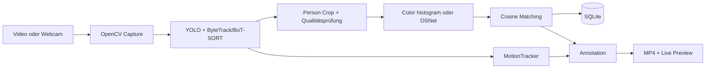

# Codebase Guide für Entwicklerinnen und Entwickler

Dieser Leitfaden erklärt die Codebase aus Entwicklungssicht. Er ist für den Einstieg, die Fehlersuche und schrittweise Refactorings gedacht. Für Installation und Bedienung ist weiterhin die [`README.md`](../README.md) zuständig; fachliche Vertiefungen stehen in [`reid_tracking_verbesserungen.md`](reid_tracking_verbesserungen.md) und [`football_mode_plan.md`](football_mode_plan.md).

## 1. Der schnellste Einstieg

Wer die Codebase neu übernimmt, sollte in dieser Reihenfolge lesen:

1. [`app/config.py`](../app/config.py) – Laufzeitpfade und alle Pipeline-Parameter.
2. [`app/storage/models.py`](../app/storage/models.py) – Datentypen zwischen den Modulen.
3. [`app/main.py`](../app/main.py) – kleiner CLI-Einstieg und Konfigurationsfluss.
4. [`app/pipeline/orchestrator.py`](../app/pipeline/orchestrator.py) – vollständiger Ablauf eines Videos.
5. [`app/pipeline/detector_tracker.py`](../app/pipeline/detector_tracker.py) und [`app/pipeline/reid_encoder.py`](../app/pipeline/reid_encoder.py) – Modelladapter.
6. [`app/storage/vector_store.py`](../app/storage/vector_store.py) – Matching und Persistenz.
7. [`app/ui/streamlit_app.py`](../app/ui/streamlit_app.py) – UI erst lesen, wenn der Kernablauf verstanden ist.

Für einen leichten lokalen Lauf ohne optionales Torchreid:

```powershell
python -m app.main --source path\to\video.mp4 --encoder colorhist --max-frames 100
```

`colorhist` ist nur ein technischer Demo-Encoder. Aussagen über echte ReID-Qualität sollten mit OSNet beziehungsweise einem vergleichbaren ReID-Modell geprüft werden.

## 2. Mentales Modell

Die Anwendung ist eine synchrone Frame-Pipeline:



Wichtig ist die Trennung zweier Identitäten:

- `track_id`: kurzfristige ID des Trackers innerhalb eines Pipeline-Laufs.
- `person_id`: langfristige synthetische ID aus der SQLite-Datenbank.

Der Orchestrator verbindet beide über `track_to_person`. ReID entscheidet, ob ein neuer Track zu einer bestehenden `person_id` gehört. Genau an dieser Grenze entstehen die wichtigsten fachlichen Fehler: doppelte Zuordnungen, ID-Switches und verunreinigte Embeddings.

## 3. Einstiegspunkte und Konfigurationsfluss

### CLI

`python -m app.main` führt folgenden Weg aus:

```text
parse_args()
  -> list_modes()/get_mode()
  -> ModeConfig.to_pipeline_config(overrides)
  -> PersonReIdPipeline(config, paths)
  -> pipeline.process(source)
```

CLI-Argumente überschreiben Werte des ausgewählten Modus.

### Streamlit

`python -m streamlit run app/ui/streamlit_app.py` führt das UI-Skript bei jeder Benutzerinteraktion erneut von oben nach unten aus. Daraus folgen zwei Regeln:

- Teure oder zustandsverändernde Operationen dürfen nicht ungeschützt auf Modulebene stattfinden.
- Zustand, der einen UI-Rerun überleben soll, gehört in `st.session_state`, einen Cache oder eine persistente Komponente.

### Konfigurationspriorität

Es gibt zwei ähnliche Konfigurationstypen:

- `ModeConfig`: speicherbares Preset für einen auswählbaren Modus.
- `PipelineConfig`: konkrete Konfiguration eines einzelnen Laufs.

`ModeConfig.to_pipeline_config()` kopiert die Moduswerte und wendet danach UI-/CLI-Overrides an. Moduswerte können dadurch die Defaultwerte von `PipelineConfig` überdecken. Bei neuen Parametern müssen daher mindestens diese Stellen gemeinsam geprüft werden:

1. `PipelineConfig`
2. `ModeConfig`
3. Built-in-Modi
4. Custom-Mode-Serialisierung
5. CLI und Streamlit-UI
6. Run-Metadaten in `SQLiteVectorStore.add_analysis_run()`

## 4. Modulkarte

| Bereich | Verantwortung | Sollte nicht verantwortlich sein für |
|---|---|---|
| `app/config.py` | Pfade und Laufzeitparameter | Modellinitialisierung oder Verarbeitung |
| `app/modes/` | Presets und Modusauswahl | Frame-Verarbeitung |
| `app/pipeline/detector_tracker.py` | Personen erkennen und Track-IDs liefern | langfristige Identitäten speichern |
| `app/pipeline/reid_encoder.py` | Crop in normalisierten Vektor umwandeln | Matching oder Datenbankzugriff |
| `app/pipeline/orchestrator.py` | Schritte koordinieren und Run-Zustand halten | Details konkreter Infrastruktur |
| `app/storage/vector_store.py` | Personenprofile, Events und Ähnlichkeitssuche | Bilder zuschneiden oder UI rendern |
| `app/utils/image_utils.py` | Crop, Qualitätswerte, Vektorrechnung, Zeichnen | Run-Zustand |
| `app/utils/motion_utils.py` | Bewegung pro Track im Bildraum | Person-ReID entscheiden |
| `app/utils/camera_utils.py` | Kameras finden und öffnen | Pipeline konfigurieren |
| `app/ui/streamlit_app.py` | Eingaben, Fortschritt und Ergebnisse anzeigen | fachliche Matching-Regeln |

Die aktuelle Implementierung hält diese Grenzen teilweise ein. Der Orchestrator erzeugt seine konkreten Abhängigkeiten jedoch selbst; das erschwert Tests und Austauschbarkeit.

## 5. Ablauf eines Pipeline-Laufs

`PersonReIdPipeline.process()` erledigt momentan alle folgenden Schritte:

1. Quelle öffnen und Videometadaten lesen.
2. Output-Writer erzeugen.
3. Analyse-Lauf in SQLite registrieren.
4. Laufzeit-Zustände für Tracks, Kandidaten und Bewegung anlegen.
5. Frames lesen, bis Quelle oder `max_frames` beendet ist.
6. Personen erkennen und Track-IDs übernehmen.
7. Optional Bewegung und große Sprünge berechnen.
8. In konfigurierten Abständen Person-Crops erzeugen.
9. Unbrauchbare Crops über Größe und Qualitätswert verwerfen.
10. Embeddings für neue Tracks zunächst über mehrere gute Frames sammeln.
11. Kombiniertes Embedding gegen bestehende Personen suchen.
12. Person neu anlegen oder bestehendes Profil aktualisieren.
13. Annotation zeichnen, Frame schreiben und Callbacks bedienen.
14. Ressourcen schließen und `PipelineResult` zurückgeben.

### Zustände im Orchestrator

| Zustand | Schlüssel | Wert | Lebensdauer |
|---|---|---|---|
| `track_to_person` | `track_id` | `person_id` | ein Run |
| `track_to_last_score` | `track_id` | letzter Match-Score | ein Run |
| `track_candidates` | `track_id` | hochwertige Crops und Embeddings | bis zur ersten Zuordnung |
| `MotionTracker._states` | `track_id` | letzte Position und geglättete Bewegung | ein Run |
| `used_person_ids_this_frame` | – | bereits vergebene Personen-IDs | ein Frame |

Diese Zustände bilden fachliche Invarianten ab:

- Eine `person_id` sollte in einem Frame höchstens einem sichtbaren Track gehören.
- Ein schlechter Crop darf ein gespeichertes Embedding nicht verändern.
- Ein Tracker-ID-Switch darf nicht ungeprüft das Profil einer anderen Person aktualisieren.
- Zustände verschwundener Tracks müssen irgendwann verworfen werden.

Bei Änderungen am Matching sollten diese Regeln zuerst als Tests formuliert werden.

## 6. Matching und Profilaktualisierung

### Neue Tracks

Für einen noch unbekannten `track_id` werden hochwertige `TrackEmbeddingCandidate`-Objekte gesammelt. Erst ab `min_good_frames_before_reid` entsteht ein qualitätsgewichtetes, normalisiertes Embedding. Das reduziert Entscheidungen auf Basis eines einzelnen schlechten Frames.

### Suche

`SQLiteVectorStore.search()`:

1. lädt alle gespeicherten Personen-Embeddings,
2. ignoriert Vektoren mit anderer Dimension,
3. berechnet Cosine Similarity in Python,
4. liefert den besten Treffer oberhalb `match_threshold`.

Die Formprüfung erlaubt den Wechsel zwischen 32-dimensionalen Color-Histogrammen und 512-dimensionalen OSNet-Vektoren, ohne abzustürzen. Sie verhindert aber nicht, dass verschiedene Modelle mit derselben Dimension fachlich inkompatible Embeddings erzeugen. Ein zukünftiges Schema sollte deshalb Encoder und Modellversion pro Personprofil speichern.

### Aktualisierung

Ein bestehendes Profil wird als qualitätsgewichteter Mittelwert aktualisiert. Das ist günstig und einfach, kann aber durch eine falsche Track-Zuordnung dauerhaft beschädigt werden. Änderungen an dieser Stelle benötigen Tests mit:

- gleicher Person bei wechselnder Qualität,
- zwei ähnlichen Personen,
- Tracker-ID-Switch,
- langer Abwesenheit und Wiederauftauchen,
- Kamera-Cut,
- Wechsel des Encoder-Modells.

## 7. Persistenzmodell

SQLite ist gleichzeitig Personenregister, Event-Log und Run-Historie.

| Tabelle | Zweck |
|---|---|
| `persons` | synthetische ID, Mean-Embedding, Beobachtungszahl, bester Snapshot |
| `events` | einzelne gespeicherte ReID-Beobachtungen |
| `analysis_runs` | Quelle, Modus, Videoeigenschaften und Konfiguration eines Laufs |
| `teams`, `players` | vorbereitetes Football-Datenmodell |
| `player_frame_events`, `ball_frame_events` | vorbereitete Frame-Ereignisse |
| `player_stats` | vorbereitete aggregierte Fußballstatistiken |

Aktuell ist die Vektorsuche `O(P × D)` pro Match: alle `P` Personen werden geladen und Vektoren der Dimension `D` in Python verglichen. Das ist für ein kleines MVP ausreichend, skaliert aber nicht für große Datenbestände.

## 8. So tauscht man Komponenten aus

### Encoder ergänzen

1. Neue Klasse von `ReIdEncoder` ableiten.
2. `encode(crop_bgr)` implementieren und immer einen eindimensionalen normalisierten Vektor liefern.
3. Backend in `build_encoder()` registrieren.
4. Auswahl in CLI, UI und `ModeConfig` ergänzen.
5. Encodername, Modellversion und Dimension mit dem Run beziehungsweise Profil speichern.
6. Tests für leeren Crop, Dimension, Datentyp und Norm ergänzen.

### Tracker ersetzen

Ein Trackeradapter muss pro Frame `list[Detection]` liefern. Für echte Austauschbarkeit sollte daraus ein `Protocol` entstehen:

```python
class PersonTracker(Protocol):
    def track_frame(self, frame_bgr: np.ndarray) -> list[Detection]: ...
```

Der Orchestrator sollte einen solchen Adapter injiziert bekommen, statt `UltralyticsPersonTracker` selbst zu erzeugen.

### Store ersetzen

Der Orchestrator benötigt fachlich nur wenige Operationen: Run registrieren, Person suchen, ID reservieren, Beobachtung speichern und Personen auflisten. Diese Operationen sollten hinter einem Repository-Interface liegen. SQLite, Qdrant oder ein In-Memory-Fake können dann dieselbe Schnittstelle implementieren.

### Modus ergänzen

Ein neuer Modus beginnt als `ModeConfig`. Feature-Flags allein implementieren jedoch kein Verhalten. Sobald ein Modus eigene Verarbeitung benötigt, sollte er eine Strategie oder Pipeline-Komposition auswählen. Der Football-Orchestrator ist aktuell nur ein vorbereiteter Platzhalter.

## 9. Empfohlene Zielarchitektur

Ein risikoarmes Refactoring verschiebt konkrete Objekte an einen Composition Root:

```text
CLI / Streamlit
    -> PipelineFactory
        -> PersonTracker
        -> ReIdEncoder
        -> IdentityRepository
        -> SnapshotStore
        -> FrameWriter
    -> PersonReIdPipeline
```

Der Kern orchestriert nur Interfaces. Konkrete Bibliotheken bleiben Adapter am Rand. Vorteile:

- schnelle Tests ohne GPU, Kamera oder Modell-Download,
- Tracker- und Encoderwechsel ohne Änderung des Ablaufs,
- klarere Fehlergrenzen,
- kleinere Funktionen,
- Football-Erweiterungen ohne weitere Flag-Verzweigungen im Kern.

### Sichere Refactoring-Reihenfolge

1. Bestehendes Verhalten mit Characterization Tests festhalten.
2. Ressourcenfreigabe und kritische Datenverlust-Risiken beheben.
3. Abhängigkeiten über optionale Konstruktorparameter injizierbar machen.
4. `process()` in kleine private Schritte zerlegen.
5. Interfaces aus dem tatsächlich benötigten Verhalten ableiten.
6. Factory für UI und CLI einführen.
7. Erst danach alternative Stores, Tracker oder Pipeline-Modi ergänzen.

Nicht gleichzeitig fachliches Matching und Architektur umbauen: Sonst ist bei geänderten Ergebnissen kaum erkennbar, ob ein Bugfix oder das Refactoring die Ursache ist.

## 10. Debugging-Playbook

### Quelle lässt sich nicht öffnen

- Pfad beziehungsweise Kameraindex prüfen.
- Auf Windows `dshow`, danach `msmf` oder `auto` testen.
- Mit `read_single_preview_frame()` isolieren, ob das Problem vor der Pipeline liegt.
- FPS, Breite und Höhe aus dem Capture protokollieren.

### Es werden keine Personen angelegt

- Prüfen, ob YOLO überhaupt `Detection`-Objekte liefert.
- `min_crop_width` und `min_crop_height` kontrollieren.
- Qualitätsdetails aus `crop_quality_score()` untersuchen.
- `min_good_frames_before_reid` temporär reduzieren.
- Sicherstellen, dass der gewählte Encoder installiert ist.

### Zu viele neue Personen

- Match-Threshold vorsichtig senken.
- Prüfen, ob sich die Embedding-Dimension oder das Modell geändert hat.
- Snapshot-Crops visuell vergleichen.
- Track-Verlust und Kandidatenpuffer pro `track_id` protokollieren.

### Verschiedene Personen werden zusammengeführt

- Match-Threshold erhöhen.
- Doppelbelegung derselben `person_id` pro Frame prüfen.
- Updates nach großen Bewegungssprüngen untersuchen.
- Nicht nur den finalen Mean-Vektor, sondern mehrere Referenz-Embeddings erwägen.

### Ausgabevideo fehlt oder ist beschädigt

- `VideoWriter.isOpened()` direkt nach der Erstellung prüfen.
- Codec-Unterstützung der lokalen OpenCV-Installation kontrollieren.
- Capture und Writer in jedem Fehlerpfad freigeben.
- Framegröße mit der Writer-Konfiguration vergleichen.

### Datenbank analysieren

- `analysis_runs` zeigt, mit welcher Konfiguration ein Lauf gestartet wurde.
- `events.payload_json` enthält Qualitäts- und Bewegungsdetails.
- `best_snapshot_path` ist der schnellste visuelle Einstieg in fehlerhafte Identitäten.
- Eine produktive Datenbank nicht zum Debuggen zurücksetzen; zuerst sichern und gezielt abfragen.

## 11. Performance effizient verbessern

Vor Optimierungen immer messen. Relevante Zeitanteile getrennt erfassen:

1. Capture/Decode
2. YOLO Detection und Tracking
3. Crop und Qualitätsbewertung
4. ReID-Encoding
5. Vektorsuche und SQLite-Schreiben
6. Zeichnen und Video-Encoding
7. Streamlit-Preview

Typische Hebel in sinnvoller Reihenfolge:

- Preview seltener aktualisieren.
- ReID nur alle `reid_every_n_frames` ausführen.
- Schlechte Crops vor dem Encoder verwerfen.
- Embeddings als NumPy-Array oder Binärformat statt JSON cachen.
- Personenmatrix einmal laden und vektorisiert vergleichen.
- SQLite-Schreibvorgänge bündeln.
- Bei wachsendem Datenbestand einen echten Vektorindex einsetzen.
- Erst nach Profiling Modellgröße, Auflösung, ONNX oder TensorRT optimieren.

Jede Optimierung braucht mindestens eine Qualitätsmetrik und eine Laufzeitmetrik. Mehr FPS sind kein Gewinn, wenn ID-Switches oder falsche Matches stark zunehmen.

## 12. Tests und Definition of Done

Die stabile Testpyramide sollte ohne Kamera, GPU und Netzwerk auskommen:

- Unit-Tests: Vektornormalisierung, Qualitätsscores, Bewegung, Pfade und Moduskonfiguration.
- Store-Tests: temporäre SQLite-Datei, Matching, Dimensionswechsel und Profilupdate.
- Pipeline-Tests: Fake-Tracker, Fake-Encoder, Fake-Writer und wenige synthetische Frames.
- Smoke-Test: kleines lokales Testvideo mit dem leichtgewichtigen Encoder.
- Optionaler Modelltest: getrennt markiert und nicht Teil jedes CI-Laufs.

Ein Bugfix ist fertig, wenn:

- der Fehler als Regressionstest reproduziert wurde,
- der Test nach dem Fix besteht,
- Ressourcen auch im Fehlerpfad freigegeben werden,
- Logs beziehungsweise Fehlermeldungen genug Kontext enthalten,
- Dokumentation und Konfigurationsdefaults konsistent sind,
- ein gemeinsamer Testlauf mit anderen offenen Fixes erfolgreich ist.

## 13. Bekannte technische Schulden

Der Branch `Frames_Optimization` enthält noch mehrere bewusst dokumentierte Risiken:

- Identitätskonsistenz und ID-Switches: GitHub-Issue `#10`
- Ressourcenfreigabe und Frame-Zählung: `#11`
- destruktiver Datenbank-Reset: `#12`
- austauschbare Pipeline-Komponenten: `#13`
- Upload-Lebenszyklus und Pfadsicherheit: `#14`
- Tests und CI-Qualitätsgates: `#15`
- Encoder-Defaults und Dependencies: `#16`
- gemeinsames Qualitätsboard: `#17`

Vor dem Aufruf von `scripts/reset_db.py` unbedingt die effektiven Pfade aus `.env` prüfen. Der aktuelle Basisbranch besitzt noch keine harte Schutzprüfung gegen zu breit konfigurierte Löschziele.

Der Football-Modus setzt in V1 weiterhin auf die Default-ReID-Pipeline. Balltracking, Pitch-Mapping, Teamklassifikation und Statistikaggregation sind vorbereitet, aber noch nicht vollständig verbunden.

## 14. Gute erste Aufgaben

Für neue Mitwirkende eignen sich diese Aufgaben in aufsteigender Komplexität:

1. Unit-Tests für `image_utils.py` und `motion_utils.py` ergänzen.
2. Konfigurationswerte zwischen `PipelineConfig`, `ModeConfig`, CLI und UI konsistent machen.
3. Capture und Writer über sichere Ressourcenverwaltung kapseln.
4. Fake-Tracker und In-Memory-Store für Pipeline-Tests bauen.
5. Abhängigkeiten in `PersonReIdPipeline` injizierbar machen.
6. Matching als eigenen Service aus `process()` herauslösen.
7. Track-Lebenszyklus und ID-Switch-Strategie explizit modellieren.

Nach diesen Schritten ist die Codebase deutlich leichter zu verstehen, gezielt zu testen und ohne Seiteneffekte zu erweitern.
