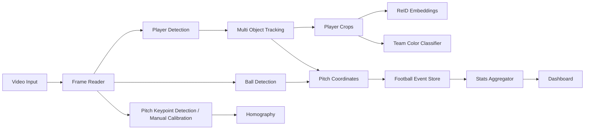

# Football Team Analysis Mode – Plan

## Ziel

Der Modus `football_team_analysis` soll langfristig Fußballvideos verarbeiten und daraus Spielertracking sowie einfache bis fortgeschrittene Statistiken erzeugen.

## V1-Umfang

Der erste Stand ist bewusst klein:

- Modus ist auswählbar.
- Modus nutzt noch die stabile Default-ReID-Pipeline.
- Eigene Football-Konfigurationsflags sind vorhanden.
- Datenbanktabellen für spätere Football-Daten sind vorbereitet.
- Platzhaltermodule für Team, Ball, Pitch Mapping und Statistik existieren.

## Geplante Pipeline

## Zu erfassende Daten

### Analyse-Lauf

- `run_id`
- `mode_id`
- `source`
- `fps`
- `frame_count`
- `width`
- `height`
- `created_at`

### Spieler pro Frame

- `run_id`
- `frame_index`
- `timestamp_sec`
- `track_id`
- `player_id`
- `team_id`
- `bbox_json`
- `pitch_x`
- `pitch_y`
- `speed_mps`
- `distance_delta_m`
- `confidence`

### Ball pro Frame

- `run_id`
- `frame_index`
- `timestamp_sec`
- `bbox_json`
- `pitch_x`
- `pitch_y`
- `speed_mps`
- `nearest_player_id`
- `nearest_team_id`
- `confidence`

## MVP-Statistiken

- sichtbare Spielzeit pro Spieler
- Laufdistanz in Metern
- Durchschnittsgeschwindigkeit
- Maximalgeschwindigkeit
- Sprintanzahl
- Heatmap-Punkte
- Ballnähe
- grobe Ballbesitz-Kandidaten

## Reihenfolge der nächsten Umsetzung

1. Team-Farbklassifikation in `orchestrator.py` nach dem Crop einbauen.
2. Football-Detektor für Klassen `player`, `goalkeeper`, `referee`, `ball` ergänzen.
3. Pitch Mapping aktivieren: Fußpunkt der Bounding Box per Homography in Meterkoordinaten umrechnen.
4. `player_frame_events` und `ball_frame_events` regelmäßig befüllen.
5. `PlayerStatsAccumulator` zur Berechnung von Distanz, Speed, Sprint und Heatmap nutzen.
